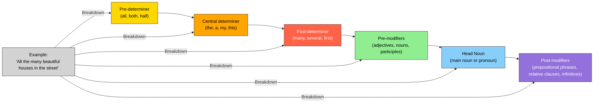

```mermaid
flowchart LR
    classDef predet fill:#FFD700,stroke:#333,stroke-width:1px,color:#000
    classDef centdet fill:#FFA500,stroke:#333,stroke-width:1px,color:#000
    classDef postdet fill:#FF6347,stroke:#333,stroke-width:1px,color:#fff
    classDef premod fill:#90EE90,stroke:#333,stroke-width:1px,color:#000
    classDef head fill:#87CEFA,stroke:#333,stroke-width:1px,color:#000
    classDef postmod fill:#9370DB,stroke:#333,stroke-width:1px,color:#fff
    classDef example fill:#D3D3D3,stroke:#333,stroke-width:1px,color:#000

    A["Pre-determiner<br/>(all, both, half)"]:::predet --> 
    B["Central determiner<br/>(the, a, my, this)"]:::centdet --> 
    C["Post-determiner<br/>(many, several, first)"]:::postdet --> 
    D["Pre-modifiers<br/>(adjectives, nouns, participles)"]:::premod --> 
    E["Head Noun<br/>(main noun or pronoun)"]:::head --> 
    F["Post-modifiers<br/>(prepositional phrases, relative clauses, infinitives)"]:::postmod

    %% Example line
    X["Example:<br/>'All the many beautiful houses in the street'"]:::example
    X -->|Breakdown| A
    X -->|Breakdown| B
    X -->|Breakdown| C
    X -->|Breakdown| D
    X -->|Breakdown| E
    X -->|Breakdown| F

    %% Clickable links for interactive learning
    click A "https://www.grammar-monster.com/glossary/pre_determiners.htm" "More on Pre-determiners"
    click B "https://www.ef.com/wwen/english-resources/english-grammar/determiners/" "More on Central determiners"
    click C "https://dictionary.cambridge.org/grammar/british-grammar/determiners" "More on Post-determiners"
    click D "https://www.perfect-english-grammar.com/adjectives.html" "More on Pre-modifiers"
    click E "https://dictionary.cambridge.org/grammar/british-grammar/nouns" "More on Nouns"
    click F "https://www.ef.com/wwen/english-resources/english-grammar/relative-clauses/" "More on Post-modifiers"
```
